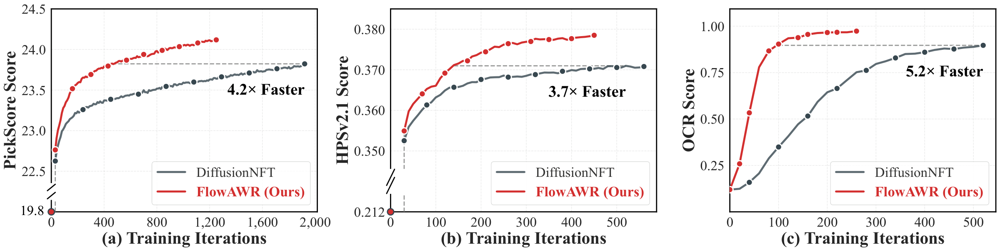
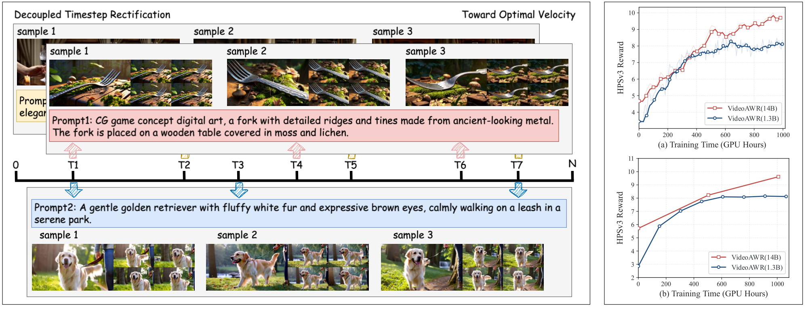
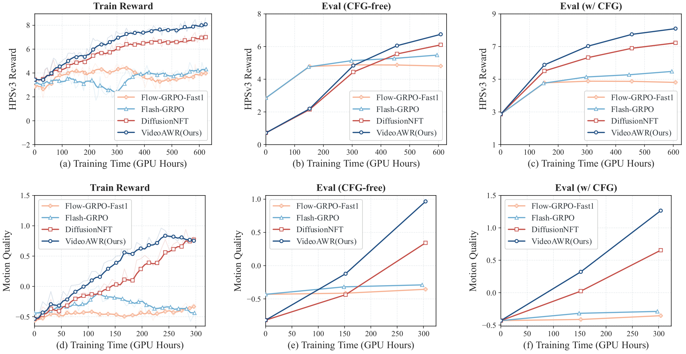
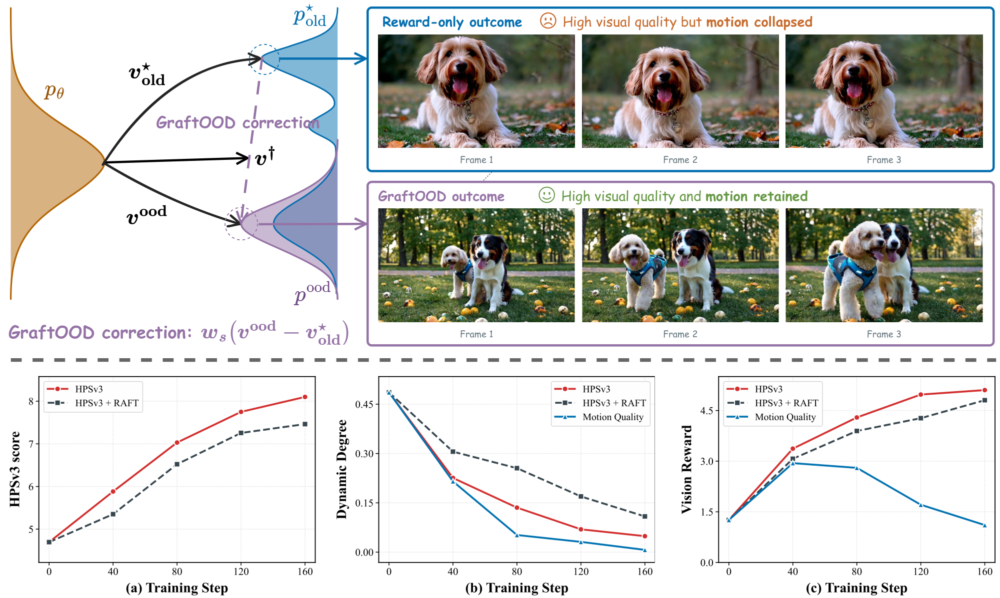
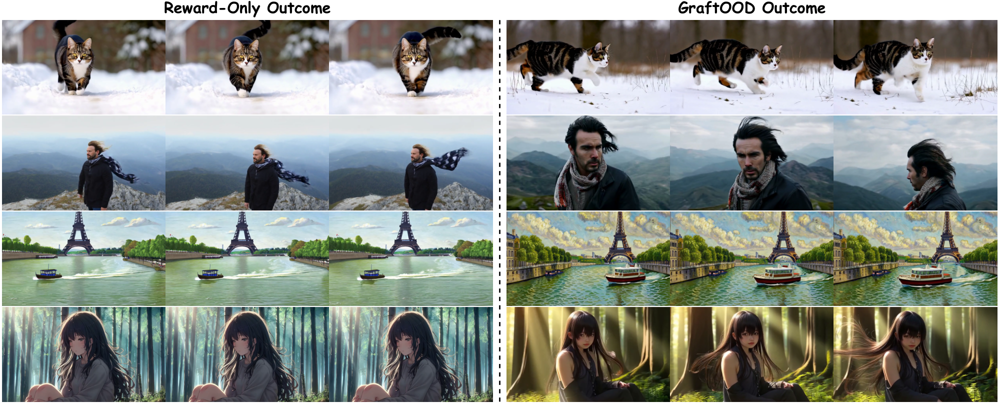

<h1 align="center">FlowAWR</h1>
<p align="center"><strong>Online Adaptive Flow Reinforcement via Advantage-Weighted Rectification</strong></p>
<p align="center">Reward-guided flow regression for image generation, with VideoAWR and GraftOOD extensions for video generation.</p>

## Overview

**Flow Advantage-Weighted Rectification (FlowAWR)** recasts reinforcement learning for generative flow models as supervised regression toward a **theoretically optimal velocity field**. Starting from a KL-regularized reward-maximization objective, FlowAWR holds the collected experience buffer and reference policy fixed within each online iteration and obtains the corresponding optimal terminal distribution. It then propagates this distribution along the Flow Matching probability path to derive the intermediate optimal distributions. Combining the Flow Matching velocity expression with **Tweedie's formula** yields the optimal velocity field as an **advantage-weighted rectification of the reference velocity field**. Unlike trajectory-likelihood methods, the training objective uses re-noised clean samples rather than log-probabilities along their generation trajectories.

- **SDE-free Online Reinforcement:** FlowAWR optimizes generative flow models through velocity regression without requiring stochastic sampling trajectories. Its residual-rectification formulation also provides a theoretical interpretation of DiffusionNFT's implicit positive and negative velocity fields.
- **Optimal Velocity Field and Advantage-Weighted Rectification:** FlowAWR derives the optimal velocity field from the closed-form optimal policy and its intermediate distributions, then uses a group-based approximation to the derived advantage to construct sample-dependent regression targets.
- **Adaptive Rectification Strength:** FlowAWR uses reward-derived advantages to adapt the direction and magnitude of velocity rectification for each sample, without manually specifying a fixed residual correction coefficient.

### Extensions

| Method | Scope | Training script | Configuration |
| :--- | :--- | :--- | :--- |
| **FlowAWR** | Image reward optimization, primarily SD3.5-Medium | [`train_awr_sd3.py`](scripts/train_awr_sd3.py) | [`config/awr.py`](config/awr.py), e.g. `sd3_pickscore` |
| **VideoAWR** | Guided video rollouts, an unguided training anchor, and independently sampled training timesteps | [`train_wan2_1_awr.py`](scripts/train_wan2_1_awr.py) | [`config/wan.py`](config/wan.py): `wan_awr_hpsv3_ultraflash` |
| **GraftOOD** | Online video reward optimization supplemented by external video exemplars | [`train_wan2_1_awr_ood.py`](scripts/train_wan2_1_awr_ood.py) | [`config/wan.py`](config/wan.py): `wan_awr_hpsv3_flash_ood` |

VideoAWR and GraftOOD are extensions of the FlowAWR regression framework, not alternative names for the image method. A separate [FLUX training entry](scripts/train_awr_flux.py) is also available; the image examples below focus on SD3.5-Medium.

## Contents

- [Results](#results)
- [Environment Setup](#environment-setup)
  - [Installation](#installation)
  - [Model Preparation](#model-preparation)
  - [Reward Preparation](#reward-preparation)
- [Training FlowAWR](#training-flowawr)
- [Evaluation](#evaluation)
- [Video Extensions](#video-extensions)
  - [VideoAWR](#videoawr)
  - [GraftOOD](#graftood)
- [Acknowledgements and Citation](#acknowledgements-and-citation)

## Results

<p align="center">
  
</p>

**Generation examples.** FLUX.1-dev optimized with FlowAWR using HPSv3 as the reward. Prompts are drawn from the HPDv2 and PickScore test sets.

<p align="center">
  
</p>

**Single-reward optimization.** FlowAWR versus DiffusionNFT on SD3.5-Medium for PickScore, HPSv2.1, and OCR. The horizontal axis measures training iterations, not wall-clock time. Both figures are reproduced from the manuscript.

## Environment Setup

### Installation

Run all commands from the repository root after cloning or downloading this repository.

```bash
conda create -n FlowAWR python=3.10.16 -y
conda activate FlowAWR

pip install torch==2.6.0 torchvision==0.21.0 \
  --index-url https://download.pytorch.org/whl/cu124
pip install -e .
```

Building FlashAttention requires a compatible CUDA toolkit and compiler.

### Model Preparation

Download [SD3.5-Medium](https://huggingface.co/stabilityai/stable-diffusion-3.5-medium) or [FLUX.1-dev](https://huggingface.co/black-forest-labs/FLUX.1-dev) and set the local model path:

```bash
export SD3_MODEL="/path/to/stable-diffusion-3.5-medium"
export FLUX_MODEL="/path/to/FLUX.1-dev"
```

The configurations and image evaluation/inference scripts read these environment variables; when unset, they use the official Hugging Face model identifiers.

### Reward Preparation

#### Checkpoints

Download reward checkpoints to `reward_ckpts/`:

```bash
mkdir -p reward_ckpts
(
  cd reward_ckpts || exit 1
  # Aesthetic
  wget https://github.com/christophschuhmann/improved-aesthetic-predictor/raw/refs/heads/main/sac+logos+ava1-l14-linearMSE.pth
  # GenEval
  wget https://download.openmmlab.com/mmdetection/v2.0/mask2former/mask2former_swin-s-p4-w7-224_lsj_8x2_50e_coco/mask2former_swin-s-p4-w7-224_lsj_8x2_50e_coco_20220504_001756-743b7d99.pth
  # CLIPScore
  wget https://huggingface.co/laion/CLIP-ViT-H-14-laion2B-s32B-b79K/resolve/main/open_clip_pytorch_model.bin
  # HPSv2.1
  wget https://huggingface.co/xswu/HPSv2/resolve/main/HPS_v2.1_compressed.pt
)
```

#### Environment

For GenEval, install MMCV 1.x and MMDetection 2.x; reuse existing checkouts if present.

```bash
pip install -U openmim
mim install mmengine

git clone --branch 1.x https://github.com/open-mmlab/mmcv.git
(
  cd mmcv || exit 1
  MMCV_WITH_OPS=1 FORCE_CUDA=1 pip install -e . -v
)
git clone --branch 2.x https://github.com/open-mmlab/mmdetection.git
pip install -e ./mmdetection -v
pip install open-clip-torch clip-benchmark
```

Install the dependencies for the rewards you use:

```bash
# OCR: verify Paddle's GPU runtime compatibility separately.
pip install paddlepaddle-gpu==2.6.2 paddleocr==2.9.1 python-Levenshtein

# HPSv2.1
pip install hpsv2x==1.2.0

# ImageReward
pip install image-reward
pip install git+https://github.com/openai/CLIP.git
```

## Training FlowAWR

Launch single-node training on eight GPUs with the presets in [`config/awr.py`](config/awr.py):

```bash
# PickScore
torchrun --nproc_per_node=8 scripts/train_awr_sd3.py --config config/awr.py:sd3_pickscore

# Multi-reward (PickScore prompts)
torchrun --nproc_per_node=8 scripts/train_awr_sd3.py --config config/awr.py:sd3_multi_reward_pickscore
```

## Evaluation

Use [`scripts/eval/evaluation_multi.py`](scripts/eval/evaluation_multi.py) with the checkpoint directory containing `lora/`. The base model is selected by `SD3_MODEL` or `--pretrained_model`:

```bash
torchrun --nproc_per_node=8 scripts/eval/evaluation_multi.py \
  --model_type=sd3 \
  --checkpoint_path=/path/to/checkpoint-N \
  --dataset geneval ocr pickscore drawbench \
  --method_name=FlowAWR \
  --mixed_precision=fp16 \
  --output_dir=evaluation_output/flowawr_pickscore \
  --save_images
```

## Video Extensions

<a id="videoawr"></a>
<details>
<summary><strong>VideoAWR: Reinforcing Video Flow Models with Decoupled-Timestep Advantage-Weighted Rectification</strong></summary>

### Overview

**VideoAWR** extends advantage-weighted rectification to video flow models by separating **guided data collection** from the **unguided regression anchor**. Unguided video rollouts can produce low-fidelity samples whose reward differences do not reflect perceptual quality. Enabling CFG improves the collected samples, but using the guided field as the regression anchor can repeatedly amplify guidance under reference-policy updates. VideoAWR instead collects guided rollouts and rectifies the trainable velocity field around the unguided conditional reference.

- **Guided Rollouts, Unguided Anchor:** CFG acts during data collection, while the regression anchor and trainable forward pass remain single-branch and unguided.
- **Reward-Driven Velocity Rectification:** Under the paper's population objective, centered advantages remove the reward-neutral guidance offset in expectation, retaining the reward-correlated correction. The learned model supports both CFG-free and CFG-enabled inference.
- **Decoupled Timestep Rectification:** Each video receives an independently sampled training timestep, allowing one prompt group to supervise multiple points along the flow rather than sharing a single timestep across the group.

<p align="center">
  
</p>

**Method and scaling.** Independent per-video timestep supervision, with HPSv3 training and held-out reward curves for Wan2.1-1.3B and 14B.

<p align="center">
  
</p>

**Reward comparisons.** HPSv3 and Motion Quality against training cost in GPU-hours, with separate CFG-free and CFG-enabled evaluation. Figures are reproduced from the VideoAWR manuscript.

### Training

Training script: [`scripts/train_wan2_1_awr.py`](scripts/train_wan2_1_awr.py). Configuration: [`config/wan.py`](config/wan.py), `wan_awr_hpsv3_ultraflash` (1.3B) or `wan_awr_hpsv3_ultraflash_14b` (14B).

Set `WAN_MODEL` for a local Wan2.1-1.3B directory or `WAN_14B_MODEL` for 14B; otherwise the configurations use the official Hugging Face identifiers. Provide a trusted HPSv3 service compatible with [`flow_grpo/rewards.py`](flow_grpo/rewards.py); the client uses pickle-encoded HTTP payloads. Server launch instructions will be provided separately.

```bash
export REWARD_VIDEO_HPSV3_URL="http://YOUR_REWARD_HOST:PORT"

torchrun --nproc_per_node=8 scripts/train_wan2_1_awr.py \
  --config config/wan.py:wan_awr_hpsv3_ultraflash \
  --config.sample.num_batches_per_epoch=12
```

### Inference

Load the saved adapter directory directly. Use `--guidance_scale=1.0` for CFG-free generation or `4.5` for guided generation.

```bash
torchrun --nproc_per_node=8 scripts/eval/inference_wan2_1.py \
  --config config/wan.py:wan_awr_hpsv3 \
  --lora_path=/path/to/checkpoint-N-ema \
  --guidance_scale=1.0 \
  --output_dir=inference_output/videoawr
```

</details>

<a id="graftood"></a>
<details>
<summary><strong>GraftOOD: Grafting Out-of-Distribution Exemplars into Advantage-Weighted Rectification for Video Reward Optimization</strong></summary>

### Overview

**GraftOOD** addresses **motion collapse** in video reward optimization: proxy rewards can increase while video dynamics decline, even when optimizing a video-level motion-quality reward. It replaces some online rollouts in selected prompt groups with out-of-distribution video exemplars. Online samples retain advantage-weighted rectification, while external videos provide sequence-level supervision through the same velocity-regression objective.

- **Beyond Scalar Reward Feedback:** External video sequences supply supervision for temporal behavior that the selected reward may not adequately constrain.
- **One Regression Objective:** Online and exemplar targets share a velocity-regression loss, without requiring exemplar generation trajectories or an additional tuned supervised-loss coefficient. The paper characterizes the pointwise optimum as a source-posterior-weighted combination of the two target fields.
- **GraftSet-Video:** The paper introduces 9,588 format-matched exemplars for 2,397 prompts. On Wan2.1-1.3B, the main setting increases Dynamic Degree from 4.86 to 44.41 relative to reward-only FlowAWR, while HPSv3 decreases from 8.10 to 7.32. This is a dynamics–reward trade-off, not a uniform improvement across metrics.

<p align="center">
  
</p>

**Motivation and method.** Exemplar-guided correction supplements the reward-driven field. The lower panels show how reward-only training can increase HPSv3 while reducing Dynamic Degree.

<p align="center">
  
</p>

**Video comparisons.** Same-prompt sequences from reward-only training (left) and GraftOOD (right), with frames in temporal order. Figures are reproduced from the GraftOOD manuscript.

### Data Preparation

Prepare local exemplar videos and a JSON manifest with four records per prompt for the example below:

```json
{
  "A prompt describing the video.": [
    {"video_path": "/path/to/video_1.mp4", "reward": 9.5, "model_name": "source_generator"},
    {"video_path": "/path/to/video_2.mp4", "reward": 9.3, "model_name": "source_generator"},
    {"video_path": "/path/to/video_3.mp4", "reward": 9.1, "model_name": "source_generator"},
    {"video_path": "/path/to/video_4.mp4", "reward": 8.9, "model_name": "source_generator"}
  ]
}
```

The manifest format is defined in [`dataset/ood/schema.json`](dataset/ood/schema.json). Each prompt must contain exactly `sample.n_ood_per_prompt` records sorted by descending reward, with videos prepared as 81 frames at 832×480 and 16 fps. Only the schema is included here; GraftSet-Video manifests and videos will be released separately.

### Training

Training script: [`scripts/train_wan2_1_awr_ood.py`](scripts/train_wan2_1_awr_ood.py). Configuration: [`config/wan.py`](config/wan.py), `wan_awr_hpsv3_flash_ood`.

Set `WAN_MODEL` to use a local Wan2.1-1.3B directory and provide a trusted HPSv3 service compatible with [`flow_grpo/rewards.py`](flow_grpo/rewards.py). Server launch instructions will be provided separately. The example retains the paper's exemplar-prompt ratio and online-reward scaling:

```bash
export REWARD_VIDEO_HPSV3_URL="http://YOUR_REWARD_HOST:PORT"

torchrun --nproc_per_node=8 scripts/train_wan2_1_awr_ood.py \
  --config config/wan.py:wan_awr_hpsv3_flash_ood \
  --config.ood_json=/path/to/graftset_top4.json \
  --config.sample.unique_prompts=48 \
  --config.sample.ood_ratio=0.167 \
  --config.sample.global_std=True
```

The Flash-GRPO OOD baseline uses the same data configuration with a separate training entry:

```bash
torchrun --nproc_per_node=8 scripts/train_wan2_1_flash_grpo_ood.py \
  --config config/wan.py:wan_awr_hpsv3_flash_ood \
  --config.run_name=FlashGRPO_OOD \
  --config.ood_json=/path/to/graftset_top4.json \
  --config.sample.unique_prompts=48 \
  --config.sample.ood_ratio=0.167 \
  --config.sample.global_std=True
```

### Inference

Use the shared Wan inference script with the saved GraftOOD adapter. The paper's guided setting uses `--guidance_scale=4.5`.

```bash
torchrun --nproc_per_node=8 scripts/eval/inference_wan2_1.py \
  --config config/wan.py:wan_awr_hpsv3 \
  --lora_path=/path/to/checkpoint-N-ema \
  --guidance_scale=4.5 \
  --output_dir=inference_output/graftood
```

</details>

## Acknowledgements and Citation

FlowAWR builds on [DiffusionNFT](https://github.com/NVlabs/DiffusionNFT) and [Flow-GRPO](https://github.com/yifan123/flow_grpo), with model and training components from [Diffusers](https://github.com/huggingface/diffusers) and [PEFT](https://github.com/huggingface/peft). Please retain upstream license notices and consult [LICENSE](LICENSE).

If you use FlowAWR, please cite:

```bibtex
@article{fu2026flowawr,
  title={FlowAWR: Online Adaptive Flow Reinforcement via Advantage-Weighted Rectification},
  author={Fu, Zheming and He, Ruizhe and Shang, Wei and Ma, Xiaoxiao and Wang, Lei and Liu, Chang and Fu, Siming},
  journal={arXiv preprint arXiv:2606.30376},
  year={2026}
}
```

For the video extensions, also cite the corresponding work when its public bibliographic entry is available:

- **VideoAWR: Reinforcing Video Flow Models with Decoupled-Timestep Advantage-Weighted Rectification**
- **GraftOOD: Grafting Out-of-Distribution Exemplars into Advantage-Weighted Rectification for Video Reward Optimization**

Upstream DiffusionNFT reference:

```bibtex
@article{zheng2025diffusionnft,
  title = {DiffusionNFT: Online Diffusion Reinforcement with Forward Process},
  author = {Zheng, Kaiwen and Chen, Huayu and Ye, Haotian and Wang, Haoxiang and Zhang, Qinsheng and Jiang, Kai and Su, Hang and Ermon, Stefano and Zhu, Jun and Liu, Ming-Yu},
  journal = {arXiv preprint arXiv:2509.16117},
  year = {2025}
}
```
